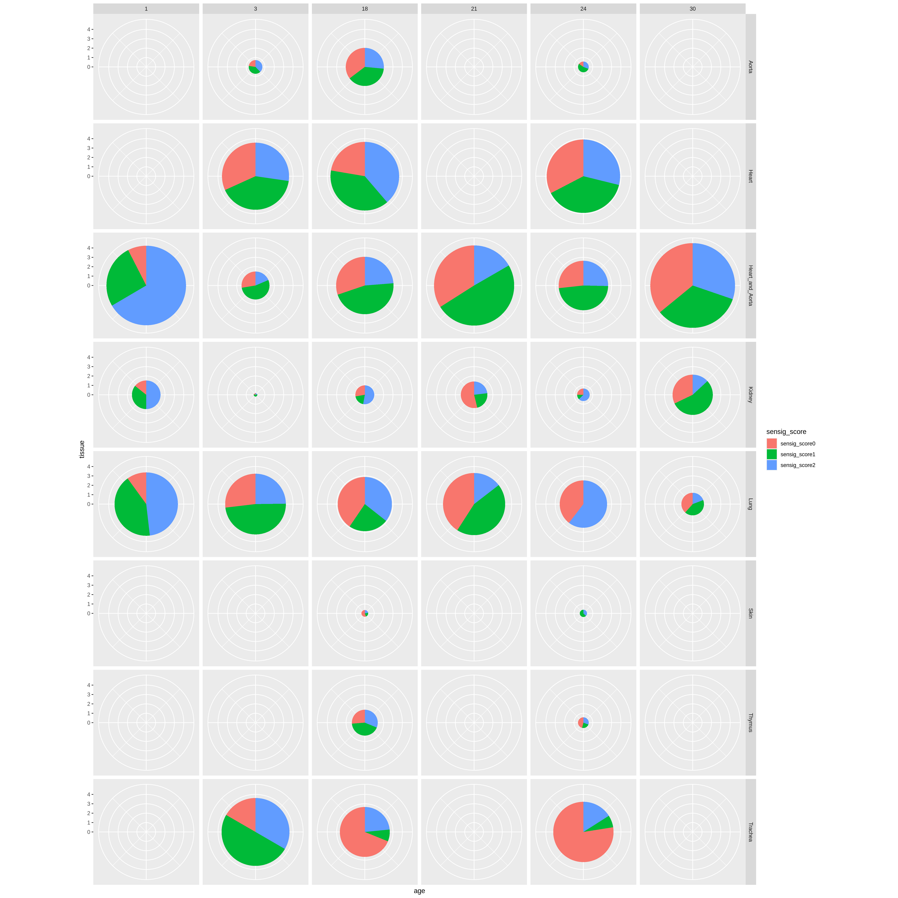
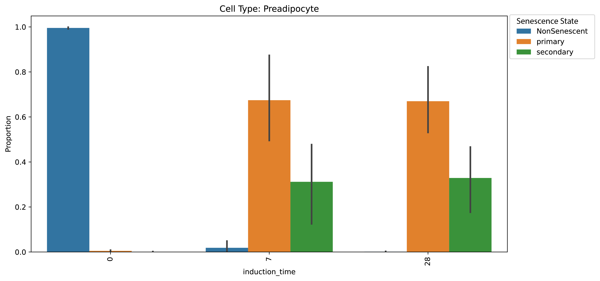

<!-- [](https://github.com/nerettilab/scrna_analysis_ml_pipeline/actions/workflows/ci.yml) -->
<!-- [](https://github.com/nerettilab/scrna_analysis_ml_pipeline/actions/workflows/linting.yml)[](https://doi.org/10.5281/zenodo.XXXXXXX) -->
<!-- [](https://www.nf-test.com) -->

[](https://www.nextflow.io/)
<!-- [](https://docs.conda.io/en/latest/) -->
<!-- [](https://www.docker.com/) -->
<!-- [](https://sylabs.io/docs/) -->
<!-- [](https://cloud.seqera.io/launch?pipeline=https://github.com/nerettilab/scrna_analysis_ml_pipeline) -->

## Introduction

**scRNA Analysis Machine Learning Composer Pipeline (SAMLCP)** is a comprehensive bioinformatics pipeline designed for analyzing single-cell RNA sequencing (scRNA-seq) data. This pipeline integrates machine learning predictions (such as cellular senescence state, cell type, or disease state), gene expression analysis, and cell cycle scoring to provide detailed insights into cellular heterogeneity and gene regulation patterns. A key strength is its ability to chain multiple machine learning models together, allowing for sophisticated multi-stage prediction workflows.

### Key Features

- **Unparalleled Flexibility**:
  - Analyze any combination of genes, predictions, and metadata groupings
  - Support for custom machine learning model predictions
  - Configurable through simple JSON files - no code changes needed
  - Works with any Scanpy AnnData or Seurat object, regardless of preprocessing method
  - Chain multiple ML models together for cascading predictions

- **Advanced ML Integration**:
  - Support for cascading predictions from multiple ML models
  - Custom class renaming and overwriting for model outputs
  - Selective class filtering between prediction stages
  - Seamless integration with gene expression and cell cycle analysis

- **Comprehensive Analysis Options**:
  - Gene expression analysis with customizable thresholds
  - Integration of any machine learning model predictions
  - Cell cycle scoring and analysis
  - Binned expression analysis for continuous variables
  - Custom metadata grouping and stratification

- **Data Preprocessing**:
  - Processes Scanpy AnnData files to incorporate:
    - Gene expression levels for genes of interest
    - Machine learning predictions
    - Cell cycle scores
  - Supports both raw and processed data
  - Handles multiple data layers and formats

- **Data Analysis**: 
  - Groups and aggregates data for statistical analysis
  - Generates TSV files for downstream visualization
  - Supports complex combinations of analysis criteria
  - Flexible metadata stratification options

- **Visualization**:
  - Creates publication-quality plots using Seaborn and ggplot2
  - Supports various visualization types for different analysis needs
  - Customizable plot parameters and aesthetics
  - Automated figure generation for all analysis combinations

## Pipeline Overview

The pipeline consists of three main stages:

1. **Data Preprocessing**
   - Input: Scanpy AnnData files
   - Processing: Integration of gene expression, ML predictions, and cell cycle scores
   - Output: Enhanced AnnData objects with additional analysis layers

2. **Data Grouping**
   - Input: Preprocessed AnnData objects
   - Processing: Aggregation and grouping of data based on specified criteria
   - Output: TSV files containing grouped data for visualization

3. **Visualization**
   - Input: Grouped data TSV files
   - Processing: Generation of statistical plots
   - Output: Publication-ready visualizations

## Usage

> [!NOTE]
> If you are new to Nextflow and nf-core, please refer to [this page](https://nf-co.re/docs/usage/installation) on how to set-up Nextflow. Make sure to [test your setup](https://nf-co.re/docs/usage/introduction#how-to-run-a-pipeline) with `-profile test` before running the workflow on actual data.

### Input Data Preparation

Prepare a samplesheet with your input data in CSV format:

`samplesheet.csv`:
```csv
sample,sc_object
SAMPLE_SCANPY_NAME,/path/to/scanpy/files/scanpy_file.h5ad
```

Each row represents a single Scanpy AnnData object to be analyzed.

Create a JSON configuration file (`threshold_combinations.json`) that defines your analysis criteria. The pipeline supports various analysis types, including chaining multiple ML models:

```json
{
  "definitions": {
    "cell_type": {
      "type": "model",
      "path": "/path/to/cell_type_model.pkl",
      "taxon": 9606,
      "rename_classes": {
        "T_cell": "T",
        "B_cell": "B"
      }
    },
    "senescence": {
      "type": "model",
      "path": "/path/to/senescence_model.pkl",
      "taxon": 9606,
      "model_select": {
        "keep_classes": ["Senescent"]
      }
    },
    "primary_vs_secondary_senescent": {
      "type": "model",
      "path": "/path/to/disease_model.pkl",
      "taxon": 9606,
      "overwrite_classes": {
        "primary": "Primary",
        "secondary": "Secondary"
      }
    }
  },
  "combinations": [
    ["cell_type", "senescence", "disease_state"]
  ]
}
```

This configuration demonstrates:
- Chaining multiple ML models together
- Renaming classes from the first model
- Filtering predictions based on previous model results

### Running the Pipeline

Basic command:
```bash
nextflow run nerettilab/scrna_analysis_ml_pipeline \
   -profile <docker/singularity/.../institute> \
   --input samplesheet.csv \
   --outdir <OUTDIR> \
   --threshold_combinations threshold_combinations.json \
   --column1 age \
   --column2 cell_type
```

Required parameters:
- `--input`: Path to comma-separated file containing information about the samples in the experiment
- `--outdir`: The output directory where the results will be saved
- `--threshold_combinations`: Path to JSON file containing the combinations of factors to be analyzed
- `--column1`: First grouping category (e.g., age, condition)
- `--column2`: Second grouping category (e.g., cell type)

Optional parameters:
- `--sample_column`: Column name for sample identification
- `--use_raw`: Whether to use raw counts
- `--layer_name`: Layer name to use for analysis
- `--minimal_genes`: Whether to subset to minimal required genes
- `--random_sample_proportion`: Proportion for random cell sampling

For more detailed usage instructions and parameter descriptions, please refer to the [documentation](docs/usage.md).

> [!WARNING]
> Please provide pipeline parameters via the CLI or Nextflow `-params-file` option. Custom config files including those provided by the `-c` Nextflow option can be used to provide any configuration _**except for parameters**_;
> see [docs](https://nf-co.re/usage/configuration#custom-configuration-files).

## Credits

nerettilab/scrna_analysis_ml_pipeline was originally written by Samuel Hinthorn.

## Contributions and Support

If you would like to contribute to this pipeline, please see the [contributing guidelines](.github/CONTRIBUTING.md).

## Citations

<!-- TODO nf-core: Add citation for pipeline after first release. Uncomment lines below and update Zenodo doi and badge at the top of this file. -->
<!-- If you use nerettilab/scrna_analysis_ml_pipeline for your analysis, please cite it using the following doi: [10.5281/zenodo.XXXXXX](https://doi.org/10.5281/zenodo.XXXXXX) -->

An extensive list of references for the tools used by the pipeline can be found in the [`CITATIONS.md`](CITATIONS.md) file.

This pipeline uses code and infrastructure developed and maintained by the [nf-core](https://nf-co.re) community, reused here under the [MIT license](https://github.com/nf-core/tools/blob/master/LICENSE).

> **The nf-core framework for community-curated bioinformatics pipelines.**
>
> Philip Ewels, Alexander Peltzer, Sven Fillinger, Harshil Patel, Johannes Alneberg, Andreas Wilm, Maxime Ulysse Garcia, Paolo Di Tommaso & Sven Nahnsen.
>
> _Nat Biotechnol._ 2020 Feb 13. doi: [10.1038/s41587-020-0439-x](https://dx.doi.org/10.1038/s41587-020-0439-x).

## Output

The pipeline generates comprehensive visualizations and analysis results that help understand cellular heterogeneity and gene regulation patterns across different conditions.

### Visualizations

The pipeline creates visualizations in png, pdf, or svg format:

1. **Pie Charts**: Show the distribution of cell states within each group
   
   *Distribution of senescence scores across different  organs*

2. **Bar Charts**: Display proportions and comparisons between groups
   
   *Proportions of preadipocytes with primary vs. secondary senescence over time*

### Analysis Results

The pipeline generates several types of output files:

1. **Processed Data**:
   - TSV files containing grouped analysis results
   - Optional preprocessed h5ad files with added metadata
   - Gene combination analysis results

2. **Statistical Analysis**:
   - Proportions and counts for each combination
   - Cross-tabulation of different analysis criteria
   - Sample-level statistics when sample information is provided

3. **Pipeline Reports**:
   - Execution reports
   - Software versions
   - Resource usage logs

### Output Directory Structure

```
results/
├── preprocessed/
│   ├── sample1_processed.tsv
│   └── sample2_processed.tsv
├── pie_charts/
│   ├── sample1_pie_charts.png
│   └── sample2_pie_charts.png
├── bar_charts/
│   ├── sample1_bar_charts.png
│   └── sample2_bar_charts.png
├── multiqc/
│   ├── multiqc_report.html
│   └── multiqc_data/
└── pipeline_info/
    ├── execution_report.html
    └── software_versions.csv
```
